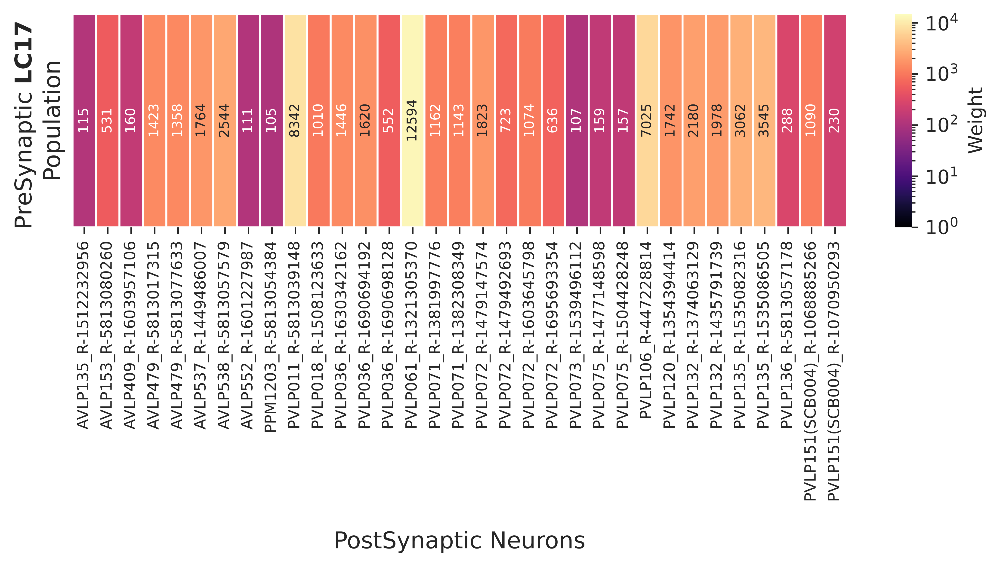

# LC17 Connectomics

Connectomic analysis of LC17 neurons and their multi-hop pathways to Descending Neurons (DNs) in the *Drosophila melanogaster* hemibrain connectome.

Current preprint version: [Frighetto-2026](https://www.biorxiv.org/content/10.1101/2025.10.14.682373v2)

## Analysis Pipeline

All analysis lives in `LC17-to-DN_Pathways.ipynb` and runs in sequence:

1. **Output connectivity** — Fetch all downstream synaptic partners of LC17 neurons from NeuPrint; aggregate weights across the LC17 population.
2. **High-confidence partners** — Filter to neurons receiving >100 total synapses from LC17; remove LC17→LC17 self-connections.
3. **Multi-hop pathway discovery** — Use `fetch_shortest_paths` (min weight: 10 synapses, max hops: 3) across all LC17-partner→DN neuron pairs.
4. **Pathway cleaning** — Remove paths traversing LC17 neurons, paths with missing intermediate neurons, and DN subtypes outside a curated subset (DNa01–04, DNa10, DNb01, DNp07, DNp09).
5. **Network construction** — Aggregate cleaned paths into a pairwise type-level connectivity matrix.
6. **Visualization** — Hierarchical clustering heatmap (Ward's method) and a layered network diagram.

## Outputs

All generated files are saved to `Pathways/`:

| File | Description |
|---|---|
| `LC17_all-outputs.{csv,parquet}` | All LC17 downstream connections (15,334 rows, 776 targets) |
| `LC17_selected-outputs-grouped.{csv,parquet}` | High-weight partners only (33 targets, weight > 100) |
| `all_paths.{csv,parquet}` | Multi-hop pathways with per-step neuron type and weight |
| `pairwise_network.{csv,parquet}` | Type-level connectivity matrix across all pathway neurons |
| `pairwise_network_woDN-prop.parquet` | Same, excluding DN→DN propagation |
| `LC17_Output-Weights.pdf` | Synaptic weight ECDF |
| `LC17_Outputs-weight-100.pdf` | High-weight connection heatmap |
| `LC17_Pathways-Cleaning.pdf` | Pathway count distributions across filtering stages |
| `LC17_Network-Heatmap.pdf` | Clustered connectivity heatmap |
| `Gios_Pathways.pdf` | Layered network diagram (LC17 partners → interneurons → DNs) |

Light microscopy images (MCFO confocal, aligned to unisex standard brain) are in `LightMicroscopy/MCFO_Screen/15D08/`.

## Network

Neurons with >= 100 synapses from the LC17 population:

Multi-hop pathways from LC17 partners to selected DNs:

## Dependencies

- [`neuprint-python`](https://github.com/connectome-neuprint/neuprint-python) — NeuPrint API client
- `pandas`, `numpy`, `scipy`, `networkx`
- `matplotlib`, `seaborn`

A NeuPrint API token is required and should be set as the `HEMIBRAIN_TOKEN` environment variable (or passed to `connectome_analysis`). Tokens are available from [neuprint.janelia.org](https://neuprint.janelia.org) after logging in.
