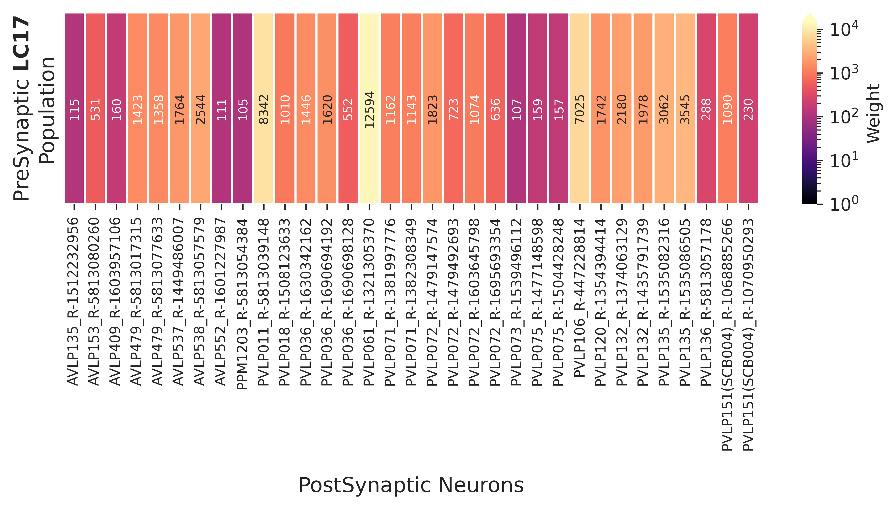
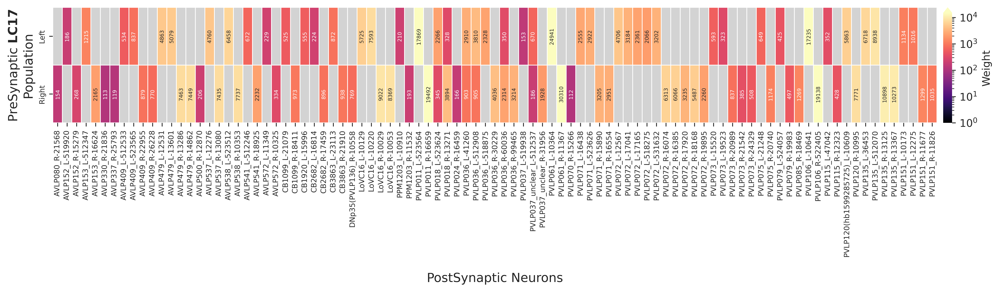
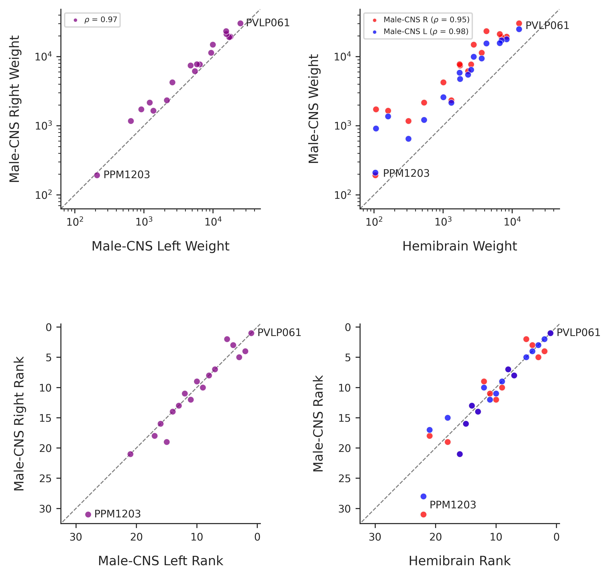
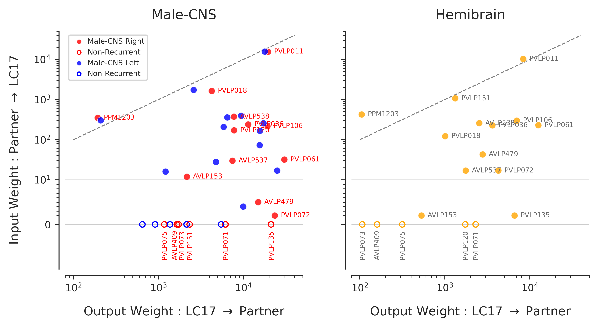
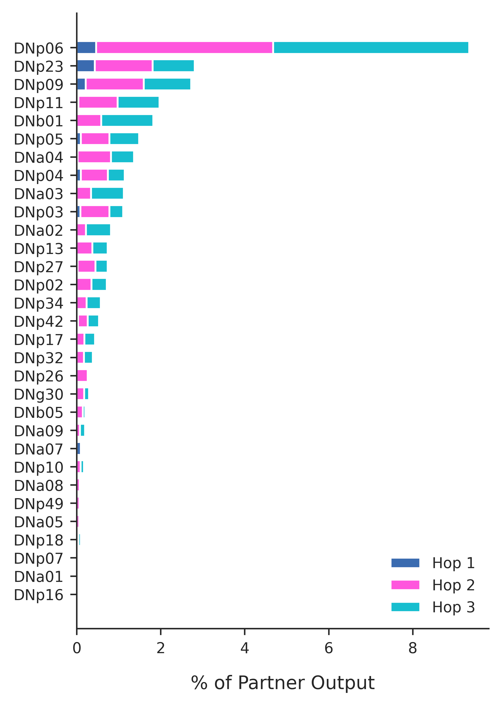
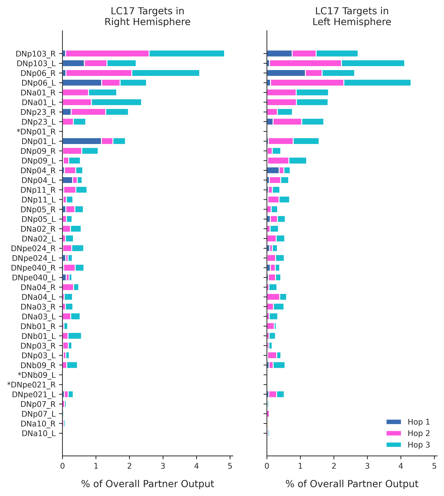
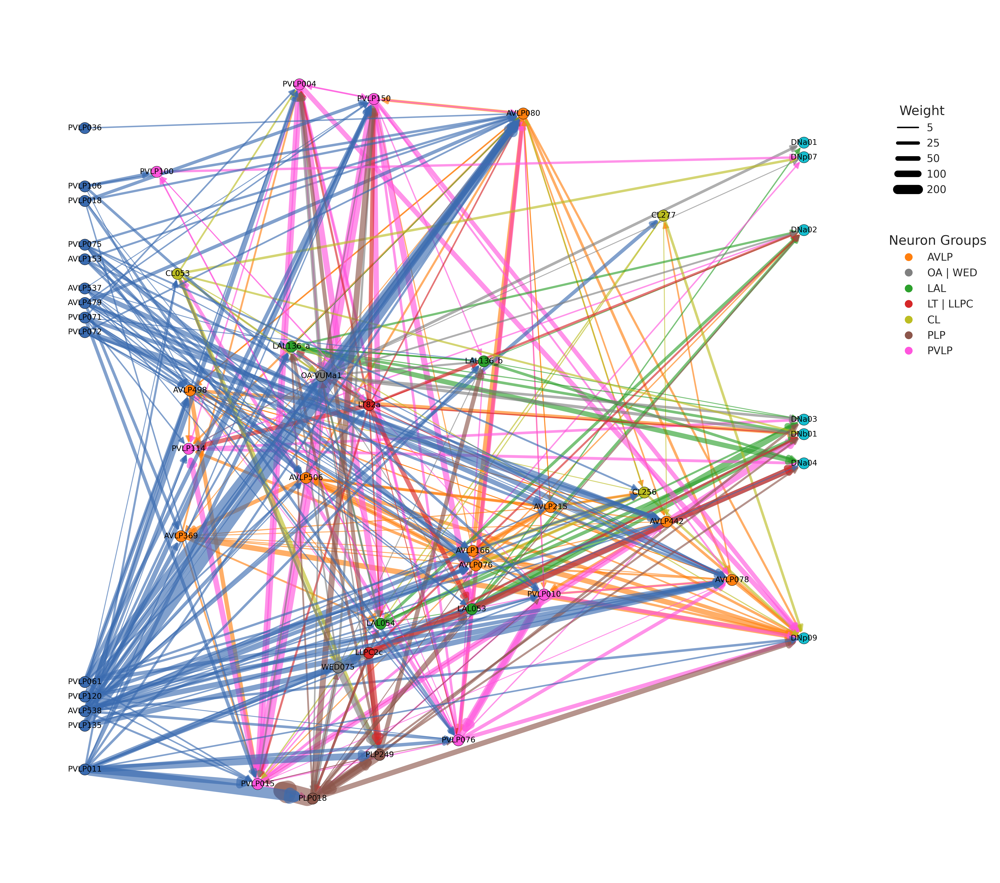
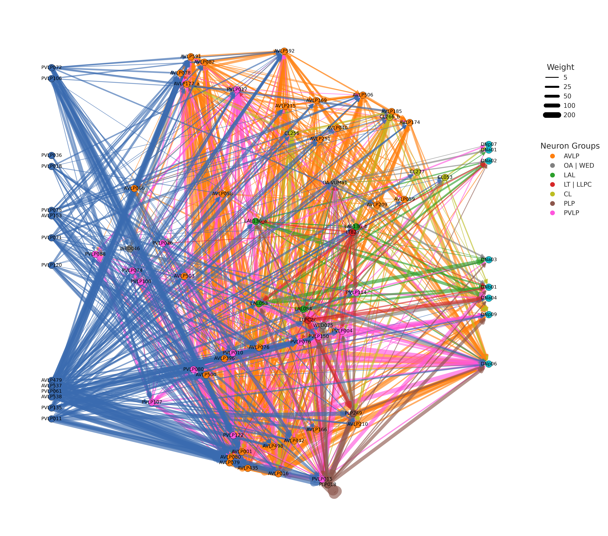

# LC17 Connectomics

Connectomic analysis of LC17 neurons and their multi-hop pathways to descending neurons (DNs) in the *Drosophila melanogaster* hemibrain and male CNS connectomes.

**Preprint:** [Frighetto et al., 2026](https://www.biorxiv.org/content/10.1101/2025.10.14.682373v2)

| Folder | Contents |
|---|---|
| [`Scripts/`](Scripts/README.md) | Data fetching from neuPrint, and the order of the analysis pipeline |
| [`Notebooks/`](Notebooks/README.md) | Analysis and figures, with a description of every output |
| `Data/` | Fetched connectivity and pathways |
| `Figures/` | Generated figures |
| `LightMicroscopy/` | MCFO confocal images (aligned to the unisex standard brain) in `MCFO_Screen/15D08/` |

---

## LC17 Partners

The first-order partners of LC17 were identified independently in each dataset. The following neurons receive more than 100 synapses from the LC17 population.

**Hemibrain**

**Male CNS**

The two datasets do not contain an identical set of partners. The partner types shared between them were therefore identified, and their weights and ranks compared.

The ranking of the shared partners is consistent across datasets and across hemispheres.

The notable exception is **PPM1203**, which receives only weak input from LC17 in both the hemibrain and the male CNS. Each LC17 neuron makes only a few synapses (approximately 1–4) onto PPM1203. Summed across the population, however, the connection exceeds the 100-synapse threshold. The functional significance of such diffuse connectivity, if any, remains unknown. PPM1203 and other neuron types with similarly diffuse connectivity are retained in the initial heatmaps.

A subset of the partners also makes **Reciprocal Connections** back onto LC17, in both datasets.

---

## Pathways to Descending Neurons

The shared partner types were used to map the multi-hop pathways from LC17's first-order partners to the DNs. The hemibrain served as the starting point, and the search was then repeated in the male CNS.

Within the hemibrain pathway network, the DNs were ranked by how much of the partners' output reaches them within 3 hops (the flow ranking).

The same analysis in the male CNS, carried out separately for the partners in each hemisphere, recovers largely the same pattern. It additionally reveals flow onto DNs that do not appear among the hemibrain DN targets, such as DNp103 and several DNpe types.

Three DN selections were used to construct the pathway networks:

- Manual selection (highlighting some of the steering DNs; Gio's Filter)
- Manual selection (highlighting some of the steering DNs; Prat's Filter)
- Top 10 DNs from the flow ranking

The male CNS pathway search was restricted to the union of these two selections.

### Gio's Filter

### Prat's Filter

Although not clearly seen in the network panels above, there is dense recurrent connectivity among the first order LC17 partners, as well as among the inter-neurons that form the network that ultimately targets the DNs. Recurrently connected pairs (with weight > 10 in both directions are highlighted in blue).

### Male CNS Gio's Filter

We can recover a similar network in the Male CNS. Since we restrict our search only to our selected DNs, we do not recover all possible paths to all DNs. However, some DN $\rightarrow$ DN connections are recovered (most notably **DNa03** in the hemibrain). They form more dense intermediate pathways and help recover additional inter-neuron players in this network. We include all these connections in the visualization for the Male CNS. 

